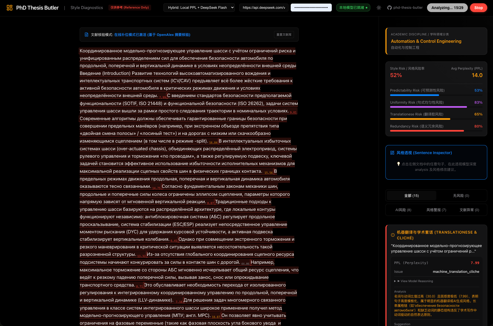

# RuScholar Studio

Локальная система для диагностики русскоязычного академического текста, проверки ссылочной цепочки и аудита рукописей через Web UI и MCP-инструменты. Проект вырос из навыка PhD Thesis Butler и теперь оформлен как самостоятельная рабочая среда для исследователя.



На скриншоте показан гибридный режим: слева находится текст рукописи с подсветкой предложений, справа — дисциплина, средняя perplexity, риски стиля, предсказуемости, переводности, избыточности и объяснение по выбранному предложению. Подсветка означает сигнал для проверки, а не окончательное обвинение.

## Возможности

- Диагностика академического стиля: клише, чрезмерные связки, пассивные конструкции, номинализация, цепочки родительного падежа, переводность.
- Локальная оценка perplexity через GGUF-модель и эвристика раннего выхода для ускорения.
- Пороговые значения по научной дисциплине и локальные правила редактирования.
- Проверка целостности цитирования между текстом и списком литературы.
- Локальный RAG-поиск по PDF/BibTeX через BM25 и опциональная проверка через OpenAlex.
- LLM/NLI-аудит: подтверждает, противоречит ли источник утверждению или данных недостаточно.
- Два режима работы: Web UI для ручной проверки и MCP для Claude, Codex, Cursor и других агентных клиентов.

## Надежность доказательной цепочки

Система должна использоваться как помощник по аудиту, а не как автоматический судья.

Наиболее надежны механические проверки: отсутствующие ссылки, несовпадение номеров, локально найденные фрагменты источников и совпадение нескольких независимых признаков. Требуют ручной проверки: низкая perplexity как признак AI-текста, высокая perplexity как признак плохого перевода, данные только из аннотации OpenAlex, а также выводы LLM/NLI.

## Требования

- Python 3.9 или новее.
- Node.js 20 или новее.
- Рекомендуется не менее 16GB RAM.
- Локальная модель Qwen3-4B-Q5_K_M GGUF занимает около 2.7GB.
- Для Apple Silicon желательно использовать Metal-сборку `llama-cpp-python`; для CPU-only режима задайте `THESIS_BUTLER_GPU_LAYERS=0`.

## Быстрый старт

```bash
git clone <YOUR_REPOSITORY_URL>
cd ruscholar-studio
./setup.sh
```

С загрузкой локальной модели:

```bash
DOWNLOAD_MODEL=1 ./setup.sh
```

Для Apple Silicon с Metal:

```bash
INSTALL_LLAMA_METAL=1 ./setup.sh
```

Windows:

```powershell
.\setup.ps1
```

## Ручная установка

```bash
python3 -m venv .venv
source .venv/bin/activate
pip install -r requirements.txt
python -m spacy download ru_core_news_sm

cd frontend
npm install
npm run build
cd ..
```

Загрузка модели:

```bash
python -c "from naturalization_layer.model_downloader import download_model; from services.shared_state import MODEL_PATH; download_model(MODEL_PATH)"
```

## Запуск Web UI

```bash
source .venv/bin/activate
python backend/main.py
```

Откройте `http://localhost:8000`. Хост и порт можно изменить:

```bash
THESIS_BUTLER_HOST=127.0.0.1 THESIS_BUTLER_PORT=8010 python backend/main.py
```

## MCP-сервер

```bash
python -m mcp_server.server
```

Пример конфигурации клиента:

```json
{
  "mcpServers": {
    "ruscholar-studio": {
      "command": "python",
      "args": ["-m", "mcp_server.server"],
      "cwd": "/YOUR_CLONE_PATH/ruscholar-studio"
    }
  }
}
```

Доступные инструменты MCP:

- `analyze_manuscript`
- `audit_citations`
- `retrieve_evidence`
- `suggest_revision`
- `export_report`
- `check_model_installed`
- `download_model_tool`
- `register_references`
- `clear_references`
- `list_references`

## Конфигурация

```bash
cp .env.example .env
```

Основные переменные:

- `DEEPSEEK_API_KEY`: ключ облачного judge-модуля.
- `DEEPSEEK_BASE_URL`: OpenAI-compatible endpoint.
- `THESIS_BUTLER_MODEL_PATH`: путь к локальной GGUF-модели.
- `THESIS_BUTLER_MODEL_URL`: источник загрузки модели.
- `THESIS_BUTLER_RULES_PATH`: путь к файлу правил.
- `THESIS_BUTLER_GPU_LAYERS`: `-1` для GPU offload, `0` для CPU-only.

## Проверка

```bash
pytest -q
cd frontend && npm run build
```

